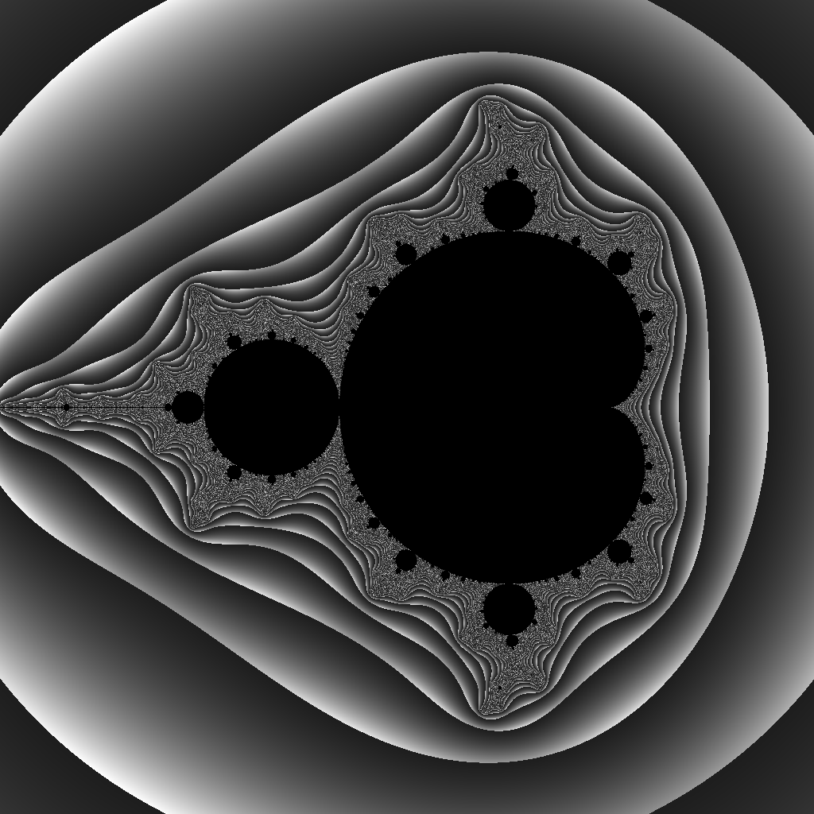

# Piske

[](https://travis-ci.org/jblondin/piske)
[](https://docs.rs/piske/badge.svg)

Piske is a domain-specific programming language designed for the creation of [generative art](https://en.wikipedia.org/wiki/Generative_art). Piske's primary goal is to provide concise, easy-to-understand syntax and semantics to facilitate the generation of a wide variety of algorithmic images.

Currently, functionality is limited, with only a very specific use cases in mind. Piske can currently generate imagery where each pixel's value is determined by some calculation of values on a corresponding two-dimensional plane. Specifically, this includes the generation of many types of fractal images.

## Example
```
let height = 1024;
let width = 1024;
set_image_dims(height, width);

let camera_center = -0.5 + 0i;
let camera_size = 3 + 3i;

let threshold = 10;
let num_max_iters = 1000;

iterate row = [0, height) {
    iterate col = [0, width) {
        let z = 0 + 0i;
        let c = project(row, col, camera_center, camera_size);
        let value = iterate over [0, num_max_iters) {
            z = z * z + c;
            let escape_value = re(z * z`);
            if escape_value > threshold {
                break escape_value;
            }
            0.0
        };
        set_pixel_data(row, col, value);
    }
}

write("mandelbrot.png");
```


## Features
Some of the features that piske includes are:
- Typical programming langauge constructs (loops, if/else, function definition and calling)
- Simplified Rust-like syntax
- If-then constructs and loop constructs treated as expressions (i.e. they have a return value)
- Standard functions for manipulating image dimensions, image data and projecting from pixel space to scene space
- Mathematics-style notation, such as interval notation (e.g. \[0, 10) to denote a range from 0 (inclusive) to 10 (exclusive)) and complex numbers (e.g. 1 + 2i is interpreted as a complex number with real part 1.0 and imaginary part 2.0)
- Static typing with inferred types
- Both interpreted and transpiled (translated) into Rust

## Usage
Piske can be used interactively, as an interpreter, or a transpiler into Rust.

### Interactive shell
```
$ piske
>> let a = 5;
5
>> a
5
>> a + 3
8
>> a = if a + 3 > 6 { 10 } else { 0 }
10
>> a
10
```

### Interpreter
Interpreting a piske file is easy. For instance, given a file named `test.psk` with contents:
```
let a = 5;
print a + 3;
```
Interpreting this file can be performed by executing:
```
$ piske test.psk
8
```

### Transpiler
For most applications, transpiling into Rust will be the best option for performance purposes. This is currently a two-step process:
```
$ piskec test.psk ./test_proj_dir
$ cd test_proj_dir
$ ls
Cargo.toml   src
$ cargo run
... (TODO)
```

The first line translates the piske code file into a Rust project located in the specified directory. Then, the code is executed by building and running the translated code using the Rust `cargo` command.

## Current and future state of piske

As mentioned, the functionality of piske is currently limited.  Many features are intended for future versions but have yet to be implemented.

Piske is currently in an ALPHA state; it has basic functionality, but is buggy, untested, and subject to change.

Planned future features include:
- Structs and struct member access, which should improve the conciseness of the language (for example, having a `camera` struct with center and size, instead of treating them as two separate complex numbers)
- Special syntax for iterating over, for example, every pixel in the target image
- Alternative image generation methods (e.g. distribution sampling, path following)
- Additional control over how image pixel values are generated from image data array (currently the `write` function makes a bunch of assumptions that you want something that looks like a fractal)
- Integration with a [matrix](https://github.com/jblondin/matrix) library to allow for matrix-based manipulations of image data
- Implicit concurrency (when possible)
- Colors (image generation is currently only grayscale)
- Interpreter performance improvements
- Easier-to-use transpiler, in which `piskec foo.psk` will simply just produce an executable
- Tons of testing and bugfixing!
